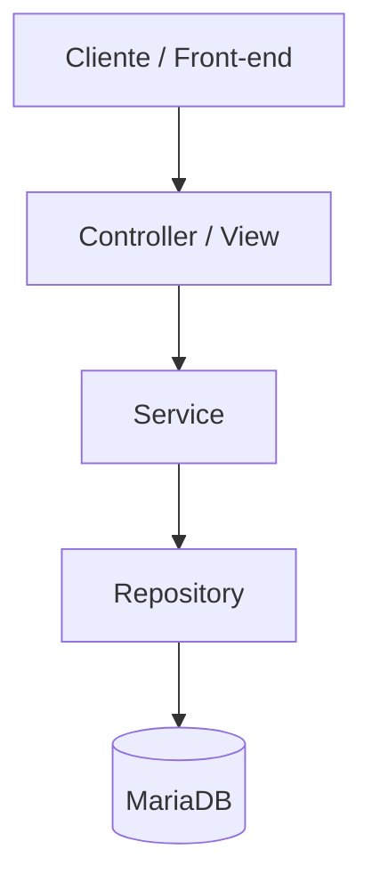

# 🌐 Quero-Peças — Plataforma B2B Inteligente de Busca e Integração de Peças Automotivas

<!-- ALL-CONTRIBUTORS-BADGE:START - Do not remove or modify this section -->

<!-- ALL-CONTRIBUTORS-BADGE:END -->

O **Quero-Peças** é uma plataforma inteligente **B2B** (Business-to-Business) projetada para conectar lojas de autopeças e oficinas mecânicas diretamente aos estoques das distribuidoras parceiras. 

Utilizando a **placa do veículo como chave inteligente de identificação**, o sistema localiza com precisão as peças compatíveis registradas, eliminando erros de compatibilidade na venda, reduzindo o tempo de atendimento e otimizando a logística de reposição automotiva.

---

## ⭐ Contribuidores do GitHub

Agradecimentos a todos os membros da equipe e colaboradores que tornaram este projeto realidade!

<table>
  <tbody>
    <tr>
      <!-- Isaque -->
      <td align="center" width="14%">
        <a href="https://github.com/isaqxd">
          
           
          <b>Isaque Costa</b>
        </a>
         
        
         
        <b>27 commits</b>
      </td>
      <!-- Geanne Arruda -->
      <td align="center" width="14%">
        <a href="https://github.com/Geannee">
          
           
          <b>Geanne Arruda</b>
        </a>
         
        
         
        <b>19 commits</b>
      </td>
      <!-- Luis Eduardo -->
      <td align="center" width="14%">
        <a href="https://github.com/sunshasdev">
          
           
          <b>Luis Eduardo</b>
        </a>
         
        
         
        <b>15 commits</b>
      </td>
      <!-- Gilmar-Viriato -->
      <td align="center" width="14%">
        <a href="https://github.com/Gilmar-Viriato">
          
           
          <b>Gilmar Viriato</b>
        </a>
         
        
         
        <b>8 commits</b>
      </td>
      <!-- lidiankelly21 -->
      <td align="center" width="14%">
        <a href="https://github.com/lidiankelly21">
          
           
          <b>Lidian Kelly</b>
        </a>
         
        
         
        <b>1 commit</b>
      </td>
      <!-- Luiz Gustavo -->
      <td align="center" width="14%">
        <a href="https://github.com/gusta-xis">
          
           
          <b>Luiz Gustavo</b>
        </a>
         
        
         
        <b>0 commits</b>
      </td>
      <!-- Lucas Gabriel -->
      <td align="center" width="14%">
        <a href="https://github.com/devlucasl">
          
           
          <b>Lucas Gabriel</b>
        </a>
         
        
         
        <b>0 commits</b>
      </td>
    </tr>
  </tbody>
</table>

---

## ✨ Funcionalidades

### Done (Já Implementado)
- **Autenticação e Sessão**: Fluxo de autenticação stateless via JWT (Token JWT gerado a partir do e-mail/CNPJ) e criptografia de senhas com BCrypt.
- **Cadastro e Gestão de Usuários (Lojistas)**: Cadastro de mecânicos com endereço, telefones e validação fiscal de CNPJ (via Stella).
- **Painel e Aprovação Administrativa**: Tela de moderação para que distribuidores (administradores) aprovem ou reprovem novos cadastros pendentes informando o motivo.
- **Busca por Placa (Inteligente)**: Consulta rápida que limpa a placa, localiza o veículo cadastrado e exibe todas as peças vinculadas que estão em estoque.
- **Busca por Código de Peça ou Modelo**: Opções de busca complementar por código original do fabricante (SKU) ou filtros de marca, modelo, ano e categoria.
- **Catálogo de Veículos & Peças (CRUD)**: Módulos de cadastro, alteração e exclusão lógica (soft delete) para a gestão do catálogo de autopeças do distribuidor.
- **Carrinho de Compras & Pedidos**: Gestão de itens no carrinho, fechamento de pedidos, atualização automática de estoque e controle de status de pagamento/entrega.
- **Módulo de Orçamentos**: Permite salvar e recuperar propostas comerciais, congelando temporariamente os preços das peças para apresentação aos clientes.
- **Relatório PDF**: Geração e exportação automática em PDF de orçamentos e pedidos a partir de templates Thymeleaf utilizando a biblioteca `openhtmltopdf`.

### Todo (O que falta implementar)
- **US-007 (Recuperar Senha)**: Implementar endpoint de envio de link e token temporário para redefinição segura de senha.
- **US-015 (Solicitar Devolução)**: Implementar fluxo para devoluções de peças de pedidos com status entregue.
- **US-016 (Solicitar Garantia)**: Fluxo completo para acionamento de garantias com upload de fotos de evidências.
- **US-017 (Solicitar Crédito)**: Cadastro e análise de limite de crédito para liberação de compras faturadas/a prazo.
- **US-018 (Envio de Boletos)**: Automatizar envio de e-mails contendo o boleto bancário formatado após fechamento do pedido.
- **US-022 (Autenticação 2FA)**: Segunda camada opcional de segurança na conta.
- **Requisitos de Privacidade (LGPD)**:
  - **US-024**: Aceite e registro imutável do consentimento nos termos da LGPD.
  - **US-025**: Exclusão e anonimização de dados do usuário mediante solicitação (respeitando prazos fiscais).
  - **US-026**: Logs imutáveis das operações de privacidade.
  - **US-027**: Exportação portátil dos dados do lojista (JSON/CSV).
- **Acessibilidade Visual (US-028)**: Adequação e testes de contraste e leitores de tela em conformidade com as normas WCAG 2.1 AA.
- **E-mails de Onboarding**: Acionamento real de disparos de e-mail ao aprovar ou reprovar lojistas (atualmente marcados como TODO no código).

---

# 🛠 Tecnologias

## 🚀 Back-end
- **Java 21**: Linguagem principal e ambiente de execução.
- **Spring Boot 4.0.6**: Framework base da aplicação.
- **Spring Security**: Configuração de autenticação e filtros de rotas.
- **Auth0 Java-JWT**: Geração, assinatura e validação de tokens JWT.
- **Spring Data JPA & Hibernate**: Persistência de dados e mapeamento objeto-relacional (ORM).
- **MariaDB / MySQL Client**: Conexão e comunicação com o banco relacional.
- **Thymeleaf**: Mecanismo de templates dinâmicos integrados.
- **Stella Bean Validation**: Validador brasileiro customizado para CPF e CNPJ.
- **OpenHTMLtoPDF**: Engine de renderização HTML/CSS para arquivos PDF compilados.
- **Lombok**: Geração dinâmica de getters, setters, construtores e builders.

---

## 🎨 Front-end
- **HTML5 & CSS3 (Vanilla)**: Telas responsivas, modulares e exclusivas criadas sem frameworks pesados.
- **JavaScript (Vanilla)**: Organização robusta do cliente utilizando o padrão de arquitetura modular (Models, Views e Controllers).
- **Fetch API**: Comunicação assíncrona entre o frontend e a API REST.

---

## 🗄️ Banco de Dados
- **Modelo Relacional**: Mapeamento estruturado das entidades com integridade referencial.
- **Chaves Estrangeiras (FKs)**: Relacionamentos fortes entre tabelas principais (ex: `Pedido` ➡ `Usuario`, `PecaPedido` ➡ `Peca` & `Pedido`).
- **Índices**: Aplicação de chaves únicas e índices sobre campos frequentes de busca (como placas e códigos de fabricante) para melhor tempo de resposta.

---

## 🧱 Arquitetura

O sistema adota o padrão de **Arquitetura em Camadas** combinada com **MVC** do Spring Boot, provendo uma separação nítida de responsabilidades de apresentação, negócio e persistência.

### Organização
- **Controllers** — Entrada das requisições, roteamento e validação de DTOs.
- **Services** — Concentra a lógica de negócio e as regras operacionais.
- **Repositories (DAOs)** — Camada de persistência que faz a ponte com o banco relacional.
- **Entities** — Objetos de domínio mapeados no MariaDB.

### Fluxo

---
