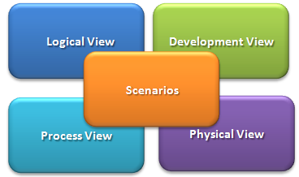
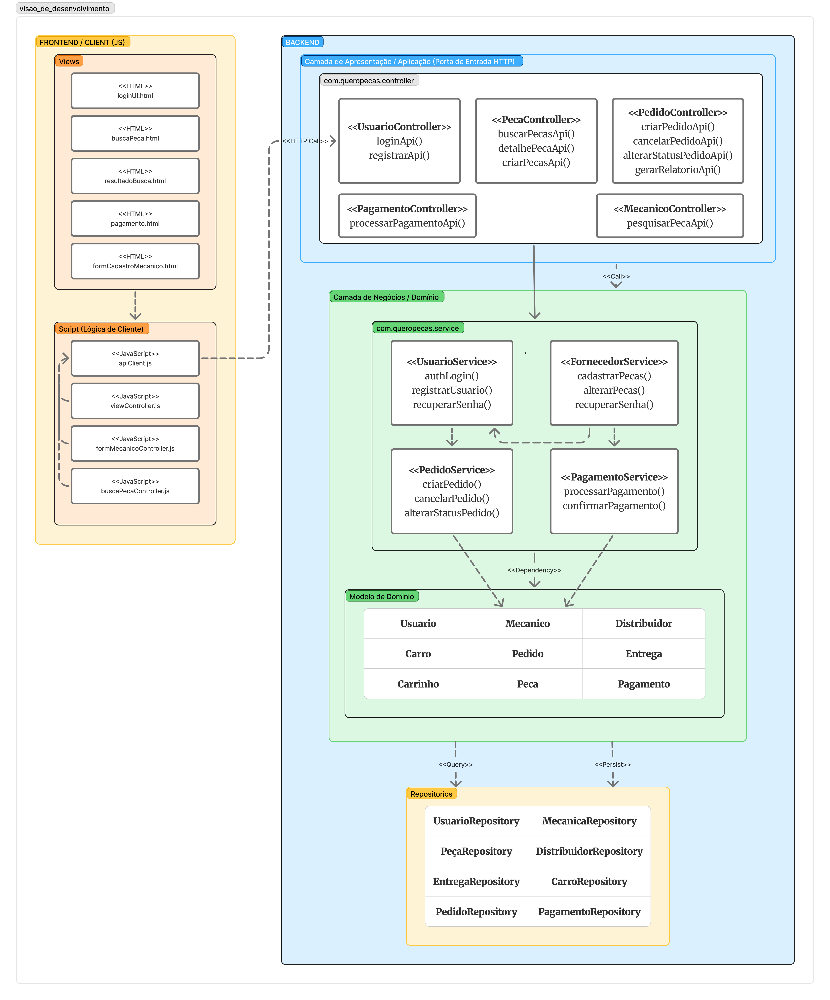
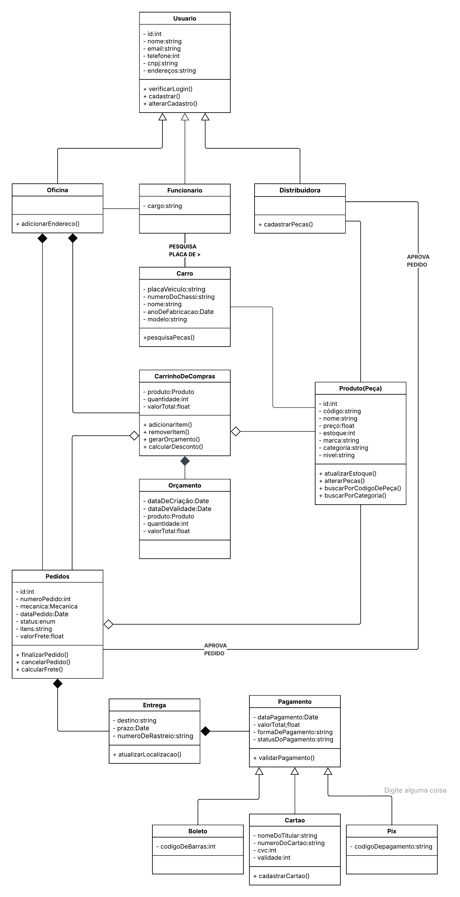

# Quero-Peças
Documento de Arquitetura de Software - Versão <1,0>

# Histórico da Revisão
| Data       | Versão | Descrição                                        | Autor                      |
|------------|--------|--------------------------------------------------|----------------------------|
| 06/04/2026 | 1.1    | Criação do Documento de arquitetura de softwware | Nome                       |
| 09/05/2026 | 1.2    | Revisão do que foi inserido na documentação      | Luis Eduardo Olibeira Maia |
| 12/04/2026 | 1.3    | Revisão geral da documentação                    | Equipe QueroPeças          |
# Índice Analítico
1. [INTRODUÇÃO](#1-introdução)
   1. [Finalidade](#11-finalidade)
   2. [Escopo](#12-escopo)
   3. [Definições, Acrônicos e Abreviações](#13-definições-acrônimos-e-abreviações)
2. [RESTRIÇÕES E REQUISITOS ARQUITETURAIS](#2-restrições-e-requisitos-arquiteturais)
3. [VISÃO DE CASOS DE USO](#3-visão-de-casos-de-uso)
4. [VISÃO LÓGICA](#4-visão-lógica)
   1. [Divisão em subsistemas e camadas do spring;](#41-divisão-em-subsistemas-e-camadas-do-spring)
   2. [Representação do domínio de aplicação;](#42-representação-do-domínio-da-aplicação)
   3. [Decisões arquiteturais](#43-decisões-arquiteturais)
   4. [Representação de arquitetura lógica;](#44-representação-da-arquitetura-lógica)
   5. [Representação do funcionamento de arquitetura](#45-representação-do-funcionamento-da-arquitetura)
5. [VISÃO DE IMPLANTAÇÃO](#5-visão-de-implantação)
6. [VISÃO DE DADOS](#6-visão-de-dados)
7. [VOLUME E DESEMPENHO](#7-volume-e-desempenho)
8. [REFERENCIAS](#referencias)
# Documento de Arquitetura de Software
## 1. INTRODUÇÃO
Este documento oferece uma visão geral arquitetural abrangente do sistema Quero-Peças, utilizando o modelo de visões 4 + 1 (Kruchten, 1994). O objetivo é capturar e comunicar as decisões arquitetônicas significativas que suportam os requisitos funcionais e não funcionais do sistema.
### 1.1 Finalidade
Fornecer uma base arquitetural sólida para o desenvolvimento da plataforma B2B de busca e venda de peças automotivas. O documento serve como guia para a equipe de desenvolvimento, garantindo consistência nas decisões técnicas e facilitando a evolução do sistema.

   
Figura 1 - Visões 4 + 1 de arquitetura de software (Kruchten, 1994)
### 1.2 Escopo
O QueroPeças é uma plataforma B2B, inteligente projetado para conectar lojas de autopeças diretamente aos estoques das distribuidoras. O sistema utiliza a placa do veículo como chave de identificação para localizar peças compatíveis, reduzindo erros de venda e aumentando a agilidade no mercado de reposição.
### 1.3 Definições, Acrônimos e Abreviações
- **B2B: Business-to-Business**
- **API: Application Programming Interface**
- **JWT: JSON Web Token**
- **TLS: Transport Layer Security**
- **LGPD: Lei Geral de Proteção de Dados (Lei n.º 13.709/2018)**
- **MVC: Model-View-Controller**
- **ORM: Object-Relational Mapping**
- **DTO: Data Transfer Object**
## 2. RESTRIÇÕES E REQUISITOS ARQUITETURAIS
| Atríbuto de qualidade          | Requisito do arquitetura                                                                                                                            | Solução                                                                                                                                                                 |
|--------------------------------|-----------------------------------------------------------------------------------------------------------------------------------------------------|-------------------------------------------------------------------------------------------------------------------------------------------------------------------------|
| **_Desempenho_**               | Resposta de busca em até 3s e consulta de estoque em até 5s para 500 usuários simultâneos.                                                          | Otimização de consultas                                                                                                                                                 |
| **_Interoperabilidade_**       | Capacidade de trocar dados com sistemas externos de diversos distribuidores de peças.                                                               | Implementação de APIs RESTful com padrão JSON para integração.                                                                                                          |
| **_Usuabilidade_**             | Garantir que o mecânico consiga finalizar um pedido em poucos cliques                                                                               | Interface responsiva com componentes intuitivos e feedback visual imediato de erros e sucessos.                                                                         |
| **_Confiabilidade_**           | [Descrição do requisito arquitetural]                                                                                                               | [Breve descrição da Solução]                                                                                                                                            |
| **_Segurança_**                | Proteção de tráfego com TLS 1.3, autenticação via JWT, proteção contra OWASP Top 10, senhas com bcrypt e criptografia de dados sensíveis (AES-256). | Spring Security com configuração de HttpSecurity, PasswordEncoder bcrypt, filtros JWT. Criptografia AES em colunas sensíveis. Validação de entrada com Bean Validation. |
| **_Facilidade de manitenção_** | Cobertura de testes ≥ 70% backend / 60% frontend. Código padronizado (Checkstyle, PMD). Documentação arquitetural (ADR).                            | JUnit + Mockito no pipeline CI (Maven).                                                                                                                                 |
| **_Portabilidade_**            | [Descrição do requisito arquitetural]                                                                                                               | [Breve descrição da Solução]                                                                                                                                            |
| **_Escalabilidade_**           | Suporte a crescimento de usuários e picos de 200 pedidos/min.                                                                                       | Arquitetura stateless (JWT) permite escalonamento horizontal. Processamento assíncrono com filas.                                                                       |
| **_Disponibilidade_**          | Uptime de 98% mensal.                                                                                                                               | Disponibilidade mensal de 99,5% com monitoramento APM.                                                                                                                  |

Tabela 1 – Restrições e requisitos arquiteturais

## 3. VISÃO DE CASOS DE USO
O sistema é orientado pelas seguintes Histórias de Usuário, que representam os requisitos funcionais:  
US-001 a US-028, conforme descrição detalhada no Documento de Especificação de Requisitos. As principais funcionalidades incluem: login, cadastro de lojistas, aprovação, cadastro de veículos/peças, buscas (placa, modelo, código), catálogo, carrinho, orçamento, compra, pós-venda (devolução, garantia, crédito), geração de boletos, relatórios e conformidade LGPD.
## 4. VISÃO LÓGICA
A arquitetura lógica segue o estilo Arquitetura em Camadas combinado com o padrão MVC do Spring Boot, promovendo separação de responsabilidades e testabilidade.
### 4.1 Divisão em subsistemas e camadas do spring
O sistema está organizado em três camadas principais, mapeadas para a estrutura de pacotes do Spring Boot:
- **Camada de Apresentação (Controller):** Responsável por receber requisições HTTP, validar entrada e retornar respostas adequadas (JSON). Utiliza anotações **@RestController**, **@RequestMapping**. Os DTOs são usados para entrada/saída.
- **Camada de Negócio (Service):** Contém toda a lógica de negócio (RNs), orquestração de fluxos (ex.: finalizar compra, validar estoque). Implementada com classes anotadas com @Service. Chama repositórios e serviços externos.
- **Camada de Dados (Repository):** Responsável pela persistência e consulta ao banco. Utiliza Spring Data JPA @Repository, interfaces como JpaRepository). Entidades mapeiam tabelas do banco MySQL.

Além disso, há componentes transversais:
- **Segurança:** **_SecurityConfig_** (Spring Security) com filtros JWT, UserDetailsService.
- **Auditoria:** Logback configurado para logs estruturados e imutáveis.

[Figura 3 - Visão Lógica Diagrama Inicial](https://drive.google.com/open?id=12Q_GM-d7IERTSqSrlxhDy-9ZShwMKK1z)
### 4.2 Representação do domínio da aplicação
O diagrama de classes é a planta baixa do software, representando visualmente os objetos e suas conexões. Ele é vital para o domínio, pois organiza as regras de negócio e garante que a estrutura do sistema reflita fielmente a realidade, servindo como um guia para o desenvolvimento e evitando erros de lógica na construção do código. 

### 4.3 Decisões arquiteturais
| Item arquiteturial                    | Decisão                                       | Justificativa                                                                                    |
|---------------------------------------|-----------------------------------------------|--------------------------------------------------------------------------------------------------|
| Estilo arquiteturial                  | MVC + API RESTful                             | Separação clara de responsabilidades, facilidade de teste e integração com frontends diversos.   |
| Linguagem de programação              | Backend: Java 17+; Frontend: JavaScript/React | Java oferece robustez e ecossistema maduro; JS/React fornece interatividade para SPA.            |
| Framework adotado                     | Spring Boot 3.x                               | Acelera o desenvolvimento com convenções, integração fácil com Spring Data, Security, Actuator.  |
| Formas de persistência                | Spring Data JPA com Hibernate                 | Abstração sobre JDBC, mapeamento objeto-relacional produtivo e suporte a consultas otimizadas.   |
| Banco de dados                        | MariaDB                                       | Familiaridade da equipe, bom desempenho para consultas relacionais e integração com Spring Boot. |
| Serviços de terceiros                 | N/A                                           | N/A                                                                                              |
| Gerenciamento de dependÊncias / Build | Maven                                         | Padronização do ciclo de vida e gestão de dependências                                           |

Tabela 2 - Decisões arquiteturais
### 4.4 Representação da arquitetura lógica
O diagrama de pacotes organiza os componentes da aplicação Spring Boot:

Figura 4 - Exemplo de pacotes

**Regras de dependência:** Controllers chamam Services; Services chamam Repositories e outros Services; Repositories acessam Entities. DTOs transitam entre camadas. A camada de segurança atua como filtro transversal.

### 4.5 Representação do funcionamento da arquitetura
O diagrama de sequência funciona como um roteiro passo a passo que mostra a ordem exata em que os objetos trocam mensagens para realizar uma tarefa. Para o programador, ele é o guia definitivo da dinâmica da arquitetura, pois revela como os dados flutuam entre as diferentes partes do sistema ao longo do tempo. Isso garante que a implementação siga a lógica planejada, evitando confusões sobre qual componente deve chamar o próximo e em que momento exato isso deve acontecer.

[Figura 4 - Exemplo de diagrama de sequencia](https://lucid.app/lucidchart/3f3aa5ea-0e55-4950-b9ae-f0597b594b07/edit?invitationId=inv_f8c38b42-5760-46b3-bd91-048d19e30b6e)
## 5. VISÃO DE IMPLANTAÇÃO
[Esta seção descreve uma ou mais configurações da rede física (hardware) na qual o software é implantado e executado. No mínimo, para cada configuração, ela deve indicar os nós físicos (computadores, CPUs) que executam o software e suas interconexões (barramento, LAN, ponto a ponto, etc.) Como sugestão, utilize o diagrama de implantação da UML.]

[Figura 5 - Diagrama de implantação ](https://drive.google.com/open?id=1qCc_Cicq4VPjieuUqEgcWQmp5TW9omYY)

## 6. VISÃO DE DADOS
[Descrição da perspectiva de armazenamento de dados persistentes do sistema. Descreva como será resolvida a persistência de arquivos e dados para o software. Apresente uma descrição das estruturas de dados e suas relações, depois inclua o Modelo Entidade-Relacionamento (MER). Será opcional se os dados forem poucos ou inexistentes.]

[Modelo Entidade-Relacionamento (MER)](./quero%20pecas%20final.brM3)

[Modelo Conceitual](./Lógico_1.brM3)
## 7. VOLUME E DESEMPENHO
* Usuários simultâneos: Suporte para até 500 usuários virtuais sob carga.
* Tempo de Resposta (Busca): ≤ 3 segundos para 90% das requisições.
* Tempo de Resposta (Estoque): ≤ 5 segundos em ambiente de produção.
* Disponibilidade (Uptime): 99,5% (downtime não planejado ≤ 216 min/mês).
* Sincronização de Dados: Atualização de estoque a cada 15 minutos via API
## REFERENCIAS
KRUCHTEN, Philippe. Architectural Blueprints—The “4+1” View Model of Software Architecture. IEEE Software, [S. l.], v. 12, n. 6, p. 42-50, nov. 1994.

QUERO-PEÇAS. **Documento de Visão do Quero-Peças**. Versão 1.x. [S. l.]: Equipe QueroPeças, 2026. Documento interno.

QUERO-PEÇAS. **Especificação de Requisitos Funcionais e Regras de Negócio** (US-001 a US-028, RN-001 a RN-032). [S. l.]: Equipe QueroPeças, 2026. Documento interno.

QUERO-PEÇAS. **Requisitos Não Funcionais (RNF-001 a RNF-016)**. [S. l.]: Equipe QueroPeças, 2026. Documento interno.

SPRING BOOT. **Spring Boot Reference Documentation**. [S. l.]: VMware, 2024. Disponível em: https://docs.spring.io/spring-boot/docs/current/reference/htmlsingle/. Acesso em: 08 maio 2026.

OWASP FOUNDATION. **OWASP Top 10 – 2021**: The Ten Most Critical Web Application Security Risks. [S. l.]: OWASP, 2021. Disponível em: https://owasp.org/Top10/. Acesso em: 08 maio 2026.

BRASIL. **Lei nº 13.709, de 14 de agosto de 2018**. Lei Geral de Proteção de Dados Pessoais (LGPD). Diário Oficial da União: seção 1, Brasília, DF, ano 155, n. 157, p. 59-64, 15 ago. 2018.
